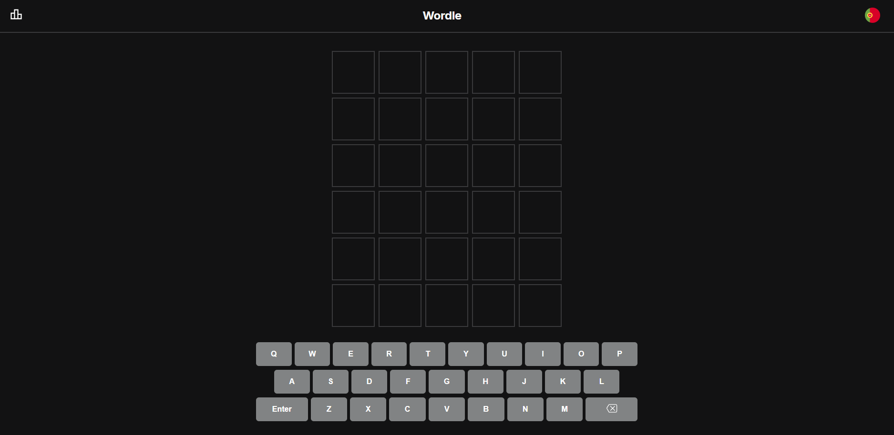

# 🧩 Wordle Clone

O Wordle Clone é uma aplicação web interativa baseada no popular jogo de adivinhação de palavras. O projeto foi desenvolvido para oferecer uma experiência de jogo fiel ao original, com foco em lógica de estado complexa, animações fluidas e um design limpo e responsivo.

## 🚀 Funcionalidades

- 🎮 Jogabilidade Clássica: Tenta adivinhar a palavra de 5 letras em 6 tentativas.
- ⌨️ Input Híbrido: Suporte total para teclado físico e teclado virtual no ecrã.
- 🎨 Feedback Visual: Cores dinâmicas para indicar o estado das letras:
  - 🟩 Verde: Letra correta na posição correta.
  - 🟨 Amarelo: Letra presente na palavra, mas na posição errada.
  - ⬛ Cinza: Letra não presente na palavra.
- ✨ Animações Realistas: Transições de revelação de blocos e animações de "shake" para palavras inválidas.
- 📱 Design Responsivo: Totalmente otimizado para desktop, tablets e dispositivos móveis.

## 🛠️ Tecnologias Utilizadas

Este projeto foi desenvolvido utilizando as seguintes tecnologias:

- **Framework:** Vite
- **Linguagem:** TypeScript
- **Estilização:** CSS
- **Gerenciamento de Estado:** React Hooks (useState, useEffect)

## 📂 Estrutura do Projeto

```text
/wordle-clone
    /src

      /assets             # Imagens, ícones e recursos estáticos

      /components         # Componentes da interface (Grelha, Teclado)

      /contexts           # Context para gestão de estado global do jogo

      /data               # Dicionário de palavras e respostas possíveis

      /hooks              # Lógica de jogo e manipulação de eventos de teclado

```

## 🚀 Demo Online

🔗 https://dannysf01.github.io/wordle-clone/

## 📸 Screenshots



## ⚙️ Como Executar o Projeto

### Pré-requisitos

- Node.js (v18 ou superior)
- npm ou yarn

### Clonar o repositório

```bash
git clone https://github.com/DannySF01/wordle-clone.git
cd wordle-clone
```

### Instalar dependências

```bash
npm install
```

### Executar em modo de desenvolvimento

```bash
npm run dev
```

## 📚 O Que Aprendi

Durante o desenvolvimento deste projeto, foram aprofundados conhecimentos em:

- Manipulação de Arrays e Strings: Implementação da lógica de comparação de palavras.
- Gestão de Eventos Global: Captura de inputs de teclado em tempo real.
- Animações CSS: Criação de feedback visual dinâmico para melhorar a experiência do utilizador.
- Tipagem Estrita: Uso de TypeScript para garantir a integridade dos dados do jogo.

---

## 👨‍💻 Autor

Desenvolvido por Daniel Fernandes

GitHub: https://github.com/DannySF01

LinkedIn: https://linkedin.com/in/daniel-f-874186115

---

## 📝 Licença

Este projeto foi desenvolvido exclusivamente para fins educativos.
